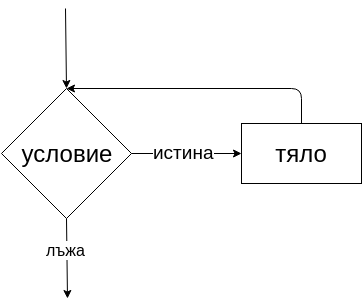
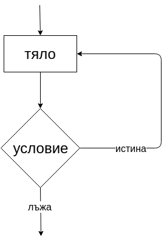

## С какво ще се занимаваме днес?
- Цикли (`while`, `do-while`, `for`)
- Ключовите думи `break` и `continue`
- Вложени цикли

# Цикли(Loops)
Нека предположим, че искаме да направим някоя програма, която да изкара на екрана първите 10 числа. То тогава ще искаме да напишем следния код:

```cpp
int main()
{
    std::cout << 1 << "\n";
    std::cout << 2 << "\n";
    std::cout << 3 << "\n";
    std::cout << 4 << "\n";
    std::cout << 5 << "\n";
    std::cout << 6 << "\n";
    std::cout << 7 << "\n";
    std::cout << 8 << "\n";
    std::cout << 9 << "\n";
    std::cout << 10 << "\n";
}
```

Ами готово! Добре де, но какво ще стане ако искаме да изкараме първите 10 000 числа? Ще трябва да изпишем 10 000 реда код. Да ама не! Забелязваме, че се извършва повторение на една обща стъпка. А тя е да изкараме някое число на екрана.

## Цикъл с предусловие `while`
Това е такъв цикъл, който се изпълнява докато дадено условие е истина.

```cpp
while (<условие>)
{
    // Тяло на цикъла
}
```

Проверява се дали условието е истина, ако условието е истина, то тогава цикъла продължава да се изпълнява, докато условието не се превърне в лъжа. Някъде в тялото трябва да се актуализита условието, иначе ще имаме безкраен цикъл.

Пример:

```cpp
int main()
{
    int i = 1;
    while (i <= 10)
    {
        std::cout << i++ << "\n";
    }
}
```

> Това е кодът от по-горе, но написан с помощта на цикъл

## Блок схема:


## Цикъл със следусловие `do-while`

При този вид цикъл, първо се изпълнява кода в тялото на цикъла и след това се проверява зададеното условие. Разликата между **следусловие** и **предусловие** е, че при цикъл със **следусловие** тялото винаги ще се изпълни поне веднъж.

```cpp
do
{
    // тяло на цикъла
} while(<условие>);
```

> **Внимание!** Когато имаме `do-while` цикъл, слагаме `;` след `while`

Пример:
```cpp
int main()
{
    int number;

    do
    {
        std::cin >> number;
    } while(n < 0)
}
```

Цикълът по-горе се изпълнява докато потрябителят не въведе число по-голямо или равно на нула.

> `do-while` е полезен за използване, когато изискваме валидни данни от потребителя.

### Блок схема


### Цикъл с предусловие `for`

```cpp
for (<инициализация>; <условие за край>; <актуализация>)
{
    // Тяло на цикъла 
}
```

> Не е задължително един `for` цикъл да притежава и трите стойности. Възможно е да направим безкраен `for` цикъл.

Безкраен `for` цикъл:
```cpp
for (;;)
```

Изпълнението започва с инициализирането на стойностти, след което се проверява условието за край, ако то върне резултат `true`, то се изпълнява тялото на цикъла, след което се изпълняват операциите в актуализация. След това всичко продължава от проверката на условие за край и така, докато това условие върне `false` и се прекратява изпълнението, продължавайки изпълнението на кода след for конструкцията.

Пример:

```cpp
for (int i = 1; i <= 10; ++i)
{
    std::cout << i << "\n";
}
```

Тук също изпълняваме задачата от по-горе с много повторения. Както виждаме, този код е много по-изчистен и лесен за разбиране, поради малкото повторения.

### Блок схема:


## Важно!
**При циклите while и do-while инициализаацията се извършва извън конструкцията за цикъл. Проверявайте дали имате случай при когото ще бъде прекъснато изпълнението. В противен случай ще попаднете в безкраен цикъл.**

## Оператор `break`

Да кажем, че в една редица `[2, 5, 3, 7, 2, 3, 4, 12, 68, 99, 12]` търсим числото 4.

Започваме да сравняваме всяко число от редицата последователно. Забелязваме, че 4 се намира в средата на нашата редица. След като проверим всяко число преди 4 и достигнем 4, ние няма нужда да продължаваме да търсим в редицата. `break` ни позволява да прекратим изпълнението на тялото на даден цикъл, независимо от стойността на зададеното условие.

Пример:

```cpp
int main()
{
    int userValue;
    int numberToGuess = 16;
    int availableTries = 5;

    bool hasGuessed = false;

    int i = 0;
    for (; i < availableTries; ++i)
    {
        std::cin >> userValue;

        if (userValue == numberToGuess)
        {
            hasGuessed = true;
            break;
        }
    }

    std::cout << "Has guessed: " << std::boolalpha << hasGuessed;
}
```

## Оператор `continue`

Докато операторът `break` предлага удобен и лесен начин за прекратяване на целия цикъл, то операторът `continue` предлага удобен начин за прекратяване на текущата итерация, т.е. прескача се частта от тялото на цикъла, която се намира след оператора `continue`. Пример: В редица от 10 числа искаме да преброим броя на числата, които са нечетни

Пример:
```cpp
int main()
{
    int counter = 0;

    for (int i = 1; i <= 10; ++i)
    {
        if (i % 2)
            continue;
        
        counter++;
    }

    std::cout << "The amount of odd numbers is " << counter;
}
```

## Вложени цикли

Когато в тялото на кои да е цикъл се съдържа друг цикъл, казваме че имаме вложени цикли(nested loops). Най-често се използват, когато работим с таблици от числа(матрици). Можем да влагаме колкото цикли пожелаем. Когато имаме само 2 цикъла, единият се нарича външен, а другия вътрешен. Moже вложените цикли да са с различни конструкции.

Пример(матрица с числата от 1 до 9):

```cpp
int main()
{
    for (int i = 0; i < 3; ++i)
	{
		for (int j = 1; j <= 3; ++j)
		{
			std::cout << j + (3 * i) << " ";
		}

		std::cout << "\n";
	}
}
```

## Флагове
Освен `break`, можем да използваме помощни флагове(flags). Такава променлива(flag) служи да маркира промяната на някакво условие, като сменя стойността си от `false` на `true` и обратното.

Пример (същият като по-горе но пропускаме числата в средата):
```cpp

int main()
{
	bool skip = false; // flag

	for (int i = 0; i < 3; ++i)
	{
		for (int j = 1; j <= 3; ++j)
		{
			if (skip)
			{
				std::cout << " ";
				skip = false;
				continue;
			}
			else
			{
				std::cout << j + (3 * i) << " ";
				skip = true;
			}
		}

		skip = false;
		std::cout << "\n";
	}
}
```
